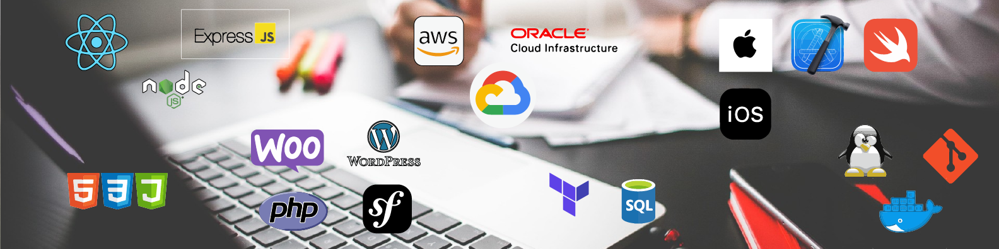

    <h1 align="left" style="color:#ffffff">Software developer</h1>

    <h2 align="justify" style="color:#ffffff">About me</h2>
    
Experienced iOS Developer with over 2 years of professional experience in creating software solutions tailored to
project needs. I have a strong background in Swift, specializing in Javascript, and expertise in mobile development
using React Native

### 

    <h2 align="left" style="color:#ffffff">Technologies</h2>
    

        <h3 align="justify" style="color:#ffffff">Programming languages</h3>
        

            <ul>
                <li>iOS, Swift</li>
                <li>Javascript</li>
                <li>Python</li>
                <li>Php</li>
            </ul>
        

    

    

        <h3 align="justify" style="color:#ffffff">Frameworks</h3>
        

            <ul>
                <li>React.JS</li>
                <li>React Native</li>
                <li>Express.JS - Next.JS</li>
                <li>Flask - Django</li>
            </ul>
        

    

### 

    <h2 align="left" style="color:#ffffff">Contacts</h2>

- LinkedIn: [https://www.linkedin.com/in/leninjimenez/]
- Portfolio: 
- Email: jlenin25@hotmail.com
- Phone: +593 979187982

    <h2 align="left" style="color:#ffffff">Tools</h2>

- Git, 
- Webpack, 
- Babel, 
- Postman, 
- Figma, 
- Axio, 
- Bootstra

- 🔭 I’m currently working on ...
- 🌱 I’m currently learning ...
- 👯 I’m looking to collaborate on ...
- 🤔 I’m looking for help with ...
- 💬 Ask me about ...
- 📫 How to reach me: ...
- 😄 Pronouns: ...
- ⚡ Fun fact: ...

<!--
**LeninJimenezTorres/LeninJimenezTorres** is a ✨ _special_ ✨ repository because its `README.md` (this file) appears on your GitHub profile.

Here are some ideas to get you started:

- 🔭 I’m currently working on ...
- 🌱 I’m currently learning ...
- 👯 I’m looking to collaborate on ...
- 🤔 I’m looking for help with ...
- 💬 Ask me about ...
- 📫 How to reach me: ...
- 😄 Pronouns: ...
- ⚡ Fun fact: ...
-->
