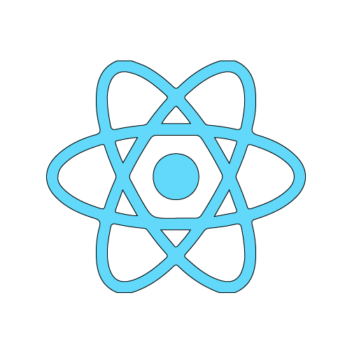
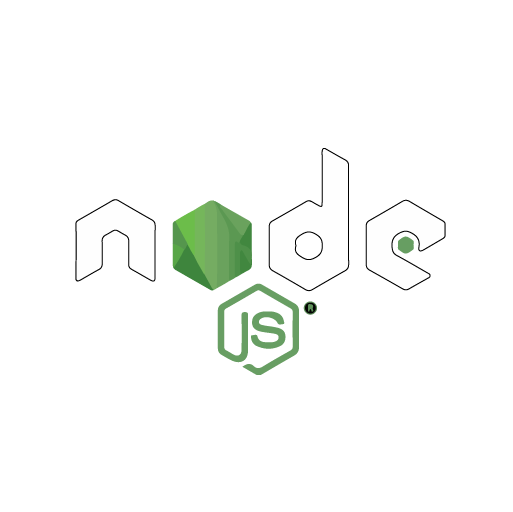

    <h1 align="left" style="color:#ffffff">Software developer</h1>

    <h2 align="justify" style="color:#ffffff">About me</h2>
    
Experienced iOS Developer with over 2 years of professional experience in creating software solutions tailored to
project needs. I have a strong background in Swift, specializing in Javascript, and expertise in mobile development
using React Native

    
My skill set includes proficiency in cloud services like AWS and Oracle Cloud Infrastructure, as well as CI/CD, Git,
Linux, and database management. Throughout my career, I have successfully developed websites, web apps,
mobile apps, RESTful APIs, 3D web rendering with Three.js, and eCommerce solutions with WordPress.

    
I am a professional passionate about programming and developing solutions, I am self-taught and proactive, I like to learn and understand about different technologies, I look for professional challenges and improve day by day.

### 

    <h2 align="justify" style="color:#ffffff">Technologies</h2>
    

        <h3 align="justify" style="color:#ffffff">Programming languages and Frameworks</h3>
        

            
iOS - Swift

            
Javascript - React - React Native

            
Node.JS - Express.JS - Next.JS

            
Python - Flask

        

    

     

        <h3 align="justify" style="color:#ffffff">Tools</h3>
         

            
AWS

            
Linux

            
Docker

            
Google cloud

            
Wordpress

            
Ecommerce

            
Git
             
            
Android
             
         

    
   

### 

    <h2 align="justify" style="color:#ffffff">Contacts</h2>

- LinkedIn: [@leninjimenez](https://www.linkedin.com/in/leninjimenez/)
- Portfolio: 
- Email: jlenin25@hotmail.com
- Phone: [Whatsapp](https://api.whatsapp.com/send?phone=593979187982)

    <h2 align="justify" style="color:#ffffff">Important Projects</h2>
    
I show you some of my most important projects

