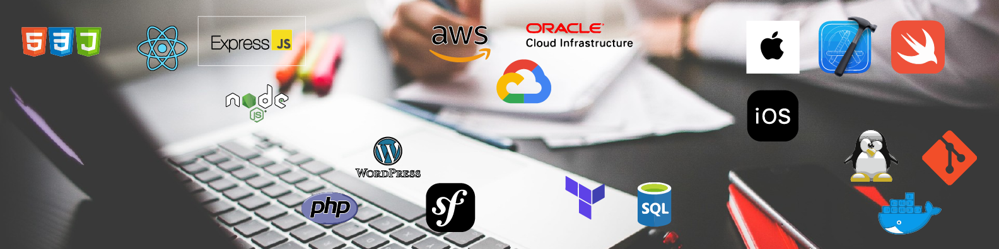

    <h1>Hello!</h1>

### Hi there 👋

# Bienvenido a mi perfil de GitHub

## Información personal

- **Nombre:** Tu nombre
- **Ubicación:** Tu ubicación
- **Correo electrónico:** Tu dirección de correo electrónico
- **Sitio web:** Tu sitio web personal

## Resumen

Breve resumen de tu experiencia y habilidades como desarrollador móvil en iOS y React Native. Destaca tus principales fortalezas y proyectos relevantes.

## Experiencia

### Desarrollador móvil - Empresa XYZ (Fechas)

- Descripción de las responsabilidades y logros en el puesto.

### Desarrollador de React - Empresa ABC (Fechas)

- Descripción de las responsabilidades y logros en el puesto.

## Habilidades

- iOS
- React Native
- React
- Node.js
- AWS
- Linux
- Bases de datos

## Proyectos destacados

- **Nombre del proyecto:** Breve descripción del proyecto y tu contribución.
- **Nombre del proyecto:** Breve descripción del proyecto y tu contribución.

## Contacto

- LinkedIn: [Tu perfil de LinkedIn](enlace a tu perfil)
- Twitter: [Tu cuenta de Twitter](enlace a tu cuenta)

### Languages
- Swift
- Javascript
- Python

- 🔭 I’m currently working on ...
- 🌱 I’m currently learning ...
- 👯 I’m looking to collaborate on ...
- 🤔 I’m looking for help with ...
- 💬 Ask me about ...
- 📫 How to reach me: ...
- 😄 Pronouns: ...
- ⚡ Fun fact: ...

<!--
**LeninJimenezTorres/LeninJimenezTorres** is a ✨ _special_ ✨ repository because its `README.md` (this file) appears on your GitHub profile.

Here are some ideas to get you started:

- 🔭 I’m currently working on ...
- 🌱 I’m currently learning ...
- 👯 I’m looking to collaborate on ...
- 🤔 I’m looking for help with ...
- 💬 Ask me about ...
- 📫 How to reach me: ...
- 😄 Pronouns: ...
- ⚡ Fun fact: ...
-->
