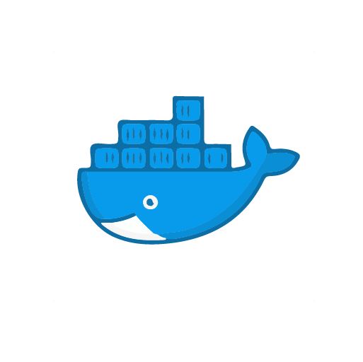
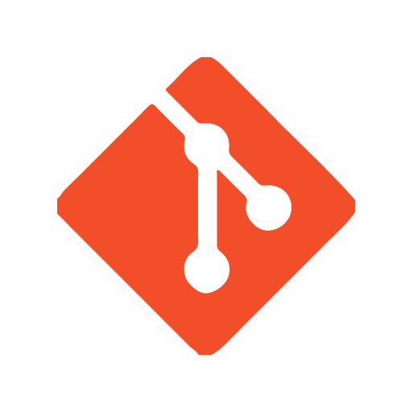

    <h1 align="left" style="color:#ffffff">Software developer</h1>

    <h2 align="justify" style="color:#ffffff">Portfolio 
        <a align="justify" style="color:#ffffff; margin-left:15px;" href="https://leninjimeneztorres.github.io/portfolio/" target="_blank">
            

                
            

        </a>
    </h2>

    <h2 align="justify" style="color:#ffffff">About me</h2>
    
Experienced iOS Developer with over 2 years of professional experience in creating software solutions tailored to
project needs. I have a strong background in Swift, specializing in Javascript, and expertise in mobile development
using React Native

    
My skill set includes proficiency in cloud services like AWS and Oracle Cloud Infrastructure as well as 3D web rendering webapps with Three.js, CI/CD, Git,
Linux, and database management. Throughout my career, I have successfully developed websites, web apps,
mobile apps, RESTful APIs, 3D web rendering with Three.js, and eCommerce solutions with WordPress.

    
I am a professional passionate about programming and developing solutions, I am self-taught and proactive, I like to learn and understand about different technologies, I look for professional challenges and improve day by day.

### 

    <h2 align="justify" style="color:#ffffff">Technologies</h2>
    

        <h3 align="justify" style="color:#ffffff">Programming languages and Frameworks</h3>
        

            
iOS - Swift

            
Javascript - React - React Native

            
Node.JS - Express.JS - Next.JS

            
Python - Flask

        

    

     

        <h3 align="justify" style="color:#ffffff">Tools</h3>
         

            
Three.js

            
AWS

            
Linux

            
Docker

            
Google cloud

            
Wordpress - Ecommerce

            
Git
             
            
Android
             
         

    
   

### 

    <h2 align="justify" style="color:#ffffff">Education - Certifications</h2>
    
    Mechatronic Engineer - Universidad de las Fuerzas Armadas

    
      JavaScript Algorithms and Data Structures - freeCodeCamp

    
      Hackmakers #FormulaAI Hack 2022: Honorable Mentions Certificate

    
      Hackmakers #FormulaAI Hack 2022: Participant Certificate

    
      OCI Foundations 2021 Associate [1Z0-1085-21] - Oracle

    
      Responsive Web Design - freeCodeCamp

    
      Cisco Certified Network Associate - CCNA - Cisco

### 

    <h2 align="justify" style="color:#ffffff">Contacts</h2>

- LinkedIn: [@leninjimenez](https://www.linkedin.com/in/leninjimenez/)
- Portfolio: [All projects](https://leninjimeneztorres.github.io/portfolio/)
- Email: jlenin25@hotmail.com
- Phone: [Whatsapp](https://api.whatsapp.com/send?phone=593979187982)

    <h2 align="justify" style="color:#ffffff">Important Projects</h2>
    
I show you some of my most important projects

    

